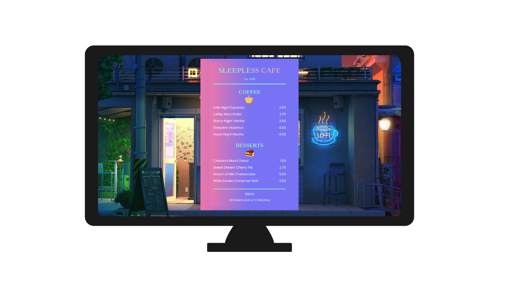

# Cafe Menu

[**Demo**](http://127.0.0.1:5501/index.html)

---
## **HTML/CSS Cafe Menu**
## Project Overview
- Build online cafe menu using only HTML and CSS.
-The HTML structure is simple and easy to understand, using semantic tags to ensure accessibility and organization.
- Use **gradient** backgrounds to stylize the menu and text, creating a modern effect.

